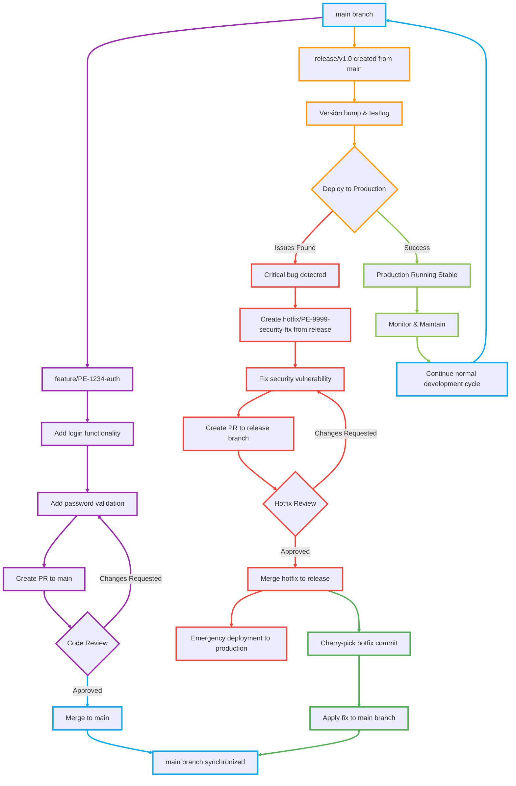

# Branching Strategy

- [Branching Strategy](#branching-strategy)
  - [Primary Branches](#primary-branches)
  - [Supporting Branches](#supporting-branches)
  - [Key Branch Policies](#key-branch-policies)
    - [Main Branch (main - Development Environment)](#main-branch-main---development-environment)
    - [Production Branch (release/ - Live Environment)](#production-branch-release---live-environment)
  - [Branching Workflow](#branching-workflow)
    - [Main](#main)
    - [Feature Development](#feature-development)
    - [Bug Fixing](#bug-fixing)
    - [Release Process](#release-process)
    - [Hotfix Process](#hotfix-process)

---

A Git branching strategy is a structured workflow for managing code changes in a collaborative development environment. It defines how developers create, merge, and manage branches to ensure a streamlined development cycle, efficient testing, and reliable deployments.

An effective branching strategy helps teams:

- Work on multiple features or bug fixes simultaneously.

- Maintain stability in different environments (development, staging, production).

- Ensure seamless integration of changes with minimal conflicts.

- Enable rapid bug fixes without disrupting ongoing development.

## Primary Branches

These always exist and represent different environments:

- `main` (Development Environment) → Active development branch. Latest integrated changes for developers.

- `release/*` (Live Environment) → Stable release code running in staging and production.

## Supporting Branches

These are temporary branches used for development and release processes:

- feature/* → Develop your features and fix bugs in feature branches based off your `main` branch

- bugfix/* → Fixes for bugs found in development (`main`).

- hotfix/* → Critical fixes for production (production) always raise a pr to release branch.

## Key Branch Policies

### Main Branch (main - Development Environment)

- Protected Branch: No direct commits allowed.

- Pull Request (PR) Required: All changes must be reviewed before merging.

- Minimum Approvals: At least 1-2 reviewers must approve the PR.

- Automated Tests: CI/CD tests must pass before merging.

- Require Up-to-Date Branch: PRs should be updated with the latest `main` changes before merging.

### Production Branch (release/ - Live Environment)

- Highly Restricted Access: Only authorized users can merge.

- Pull Request Required: Changes from hotfix/ should be merged via a PR.

- Minimum Approvals: At least 1-2 reviewers must approve the PR.

- No Direct Commits: All changes come from hotfix branches.

- Naming Mandatory: Every merge should have a version tag (vX.Y.Z).

- Emergency Hotfix Policy: Hotfix branches (hotfix/*) must be reviewed before merging.

## Branching Workflow

### Main

- The `main` branch must always be in a deployable, tested state.

- All changes flow into `main` through pull requests with validations—never direct commits.

### Feature Development

**Naming Convention:**
All branch names must follow this standardized format:

- `feature/<two-letter-team-name>-<jira-ticket-number>-<descriptive-name>`
- `bugfix/<two-letter-team-name>-<jira-ticket-number>-<descriptive-name>`
- `hotfix/<two-letter-team-name>-<jira-ticket-number>-<descriptive-name>`

**Examples:**

- `feature/PE-1234-user-authentication`
- `feature/UI-5678-payment-integration`
- `feature/BE-9012-dashboard-redesign`
- `bugfix/DV-3456-login-error-handling`
- `hotfix/DB-7890-critical-security-patch`
- `hotfix/DS-1231-critical-security-patch`

**Team Code Examples:**

- PE (Platform Engineering Team)
- UI (User Interface Team)
- BE (Backend Team)
- DB (Database Team)
- QA (Quality Assurance)
- DV (DevOps Team)
- DS (Data Science)

**Example Workflow:**

```bash
# Start new feature
git checkout main
git pull origin main
git checkout -b feature/PE-1234-user-authentication

# Work on feature, make commits
git add .
git commit -m "Add user login functionality"
git commit -m "Add password validation"

# Push and create PR
git push origin feature/PE-1234-user-authentication
# Create PR through Azure DevOps UI

# After PR approval and merge
git checkout main
git pull origin main
git branch -d feature/PE-1234-user-authentication
```

### Bug Fixing

**For bugs found in development:**

```bash
# Fix bug in main branch
git checkout main
git pull origin main
git checkout -b bugfix/PE-1234-login-error-handling

# Fix the bug
git add .
git commit -m "Fix null pointer exception in login validation"

# Create PR to main
git push origin bugfix/PE-1234-login-error-handling
```

**For bugs found in production:**

```bash
# Fix critical bug in production
git checkout release/v1.2.0
git pull origin release/v1.2.0
git checkout -b bugfix/PE-5678-critical-payment-fix

# Fix the bug
git add .
git commit -m "Fix payment processing timeout issue"

# Create PR to release branch
git push origin bugfix/PE-5678-critical-payment-fix
```

**All branch names must follow the standardized format above with team prefix and Jira ticket number.**

### Release Process

**Creating a Release Branch:**

```bash
# Create release branch from main
git checkout main
git pull origin main
git checkout -b release/v2.1.0

# Push release branch
git push origin release/v2.1.0
```

**Release Stabilization:**

- Only bug fixes and release preparation tasks
- No new features allowed
- Update version numbers, changelog
- Final testing and validation

**Production Deployment:**

```bash
# After testing is complete and approved
# Release pipeline deploys release/v2.1.0 to production
# Tag the release
git tag v2.1.0
git push origin v2.1.0
```

**Post-Release:**

```bash
# Merge any release fixes back to main via PR (main is protected)
git checkout -b sync/release-v2.1.0-to-main
git merge release/v2.1.0
git push origin sync/release-v2.1.0-to-main

# Create PR through Azure DevOps UI:
# Source: sync/release-v2.1.0-to-main
# Target: main
# Title: "Sync release v2.1.0 fixes back to main"
```

### Hotfix Process

**Critical Production Issue:**

```bash
# Create hotfix from current production release
git checkout release/v2.1.0
git pull origin release/v2.1.0
git checkout -b hotfix/PE-9999-critical-security-patch

# Fix the critical issue
git add .
git commit -m "Fix critical security vulnerability in user auth"

# Create PR to release branch
git push origin hotfix/PE-9999-critical-security-patch
```

**After Hotfix Merge:**

```bash
# Deploy hotfix to production immediately
# Then cherry-pick the fix to main via PR (main is protected)
git checkout -b sync/hotfix-PE-9999-to-main
git cherry-pick <hotfix-commit-hash>
git push origin sync/hotfix-PE-9999-to-main

# Create PR through Azure DevOps UI:
# Source: sync/hotfix-PE-9999-to-main
# Target: main
# Title: "Cherry-pick hotfix PE-9999 critical security patch to main"
```

**Emergency Deployment:**

- Hotfixes bypass normal release cycle
- Immediate deployment to production
- Minimal testing but critical for security/stability

## Visual Branching Strategy



**Branch Flow Explanation:**

- **Blue (main)**: Primary development branch
- **Orange (release)**: Production release preparation
- **Red (hotfix)**: Critical production fixes (only when issues occur)
- **Purple (feature)**: New feature development
- **Green (cherry-pick)**: Process of applying hotfix back to main branch
- **Light Green (success)**: Successful production deployment and monitoring

**Decision Points:**

- **Code Review**: PRs can be approved (merge) or require changes (back to development)
- **Production Deployment**: Can succeed (stable production) or fail (requires hotfix)
- **Hotfix Review**: Emergency fixes also require code review before deployment
- **Continuous Cycle**: Successful deployments lead back to normal development cycle
