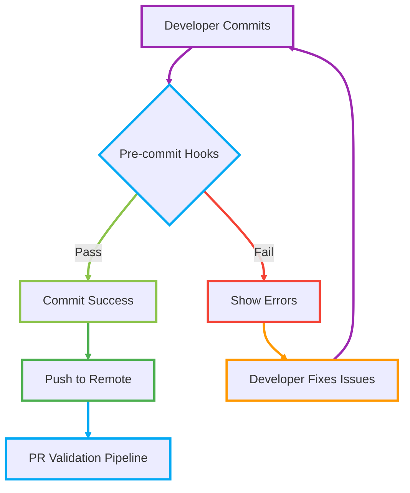

# Git Commit Hooks

- [Overview](#overview)
- [Prerequisites](#prerequisites)
- [Setup Instructions](#setup-instructions)
- [What's Included](#whats-included)
- [Manual Hook Execution](#manual-hook-execution)
- [Troubleshooting](#troubleshooting)
- [Advanced Configuration](#advanced-configuration)

---

## Overview

Pre-commit hooks are automated quality checks that run before each commit to catch issues early and maintain consistent code standards across all team members. These hooks run locally on developer machines, providing immediate feedback without waiting for CI/CD pipelines.

## Prerequisites

Before setting up git hooks, ensure you have:

- **Python 3.8+**: Required for pre-commit framework
- **Git**: Version 2.0 or higher recommended

**Check your environment:**

```bash
python --version  # Should be 3.8+
git --version     # Should be 2.0+
```

## Setup Instructions

### Step 1: Clone the Repository

```bash
git clone <your-repository-url>
cd <repository-name>
```

### Step 2: Run Bootstrap Script

The bootstrap script automatically installs pre-commit and sets up all hooks:

```bash
bash scripts/bootstrap.sh
```

**What the bootstrap script does:**

1. Installs pre-commit framework
2. Installs hook dependencies
3. Sets up git hooks in `.git/hooks/`
4. Validates the installation

### Step 3: Verify Installation

```bash
pre-commit --version
pre-commit run --all-files
```

## What's Included

The `.pre-commit-config.yaml` typically includes:

- **Code Formatting**: Prettier, Black, or language-specific formatters
- **Linting**: ESLint, Flake8, or similar tools
- **Security**: Secret detection, dependency scanning
- **Git Hygiene**: Trailing whitespace, large file detection
- **Custom Checks**: Project-specific validation rules

**Example pre-commit checks:**

## Manual Hook Execution

### Run All Hooks on All Files

```bash
pre-commit run --all-files
```

### Run Specific Hook

```bash
pre-commit run black --all-files
pre-commit run trailing-whitespace --all-files
```

### Run Hooks on Staged Files Only

```bash
pre-commit run
```

## Troubleshooting

### Common Issues and Solutions

#### Issue: Bootstrap script fails with permission error

```bash
# Solution: Make script executable
chmod +x scripts/bootstrap.sh
bash scripts/bootstrap.sh
```

#### Issue: Pre-commit command not found

```bash
# Solution: Install pre-commit manually
pip install pre-commit
# Or using homebrew on macOS
brew install pre-commit
```

#### Issue: Hooks failing due to missing dependencies

```bash
# Solution: Update hook environments
pre-commit clean
pre-commit install
pre-commit run --all-files
```

#### Issue: Python version conflicts

```bash
# Solution: Use specific Python version
python3.9 -m pip install pre-commit
# Or update .pre-commit-config.yaml to specify python version
```

#### Issue: Hooks taking too long to run

```bash
# Solution: Run hooks on changed files only
pre-commit run --files $(git diff --cached --name-only)
```

## Advanced Configuration

### Update Hooks

```bash
pre-commit autoupdate
```

### Team-Wide Hook Updates

```bash
# Update hooks and commit changes
pre-commit autoupdate
git add .pre-commit-config.yaml
git commit -m "Update pre-commit hooks"
```

## Adding Git Hooks to New Repository

### Required Files

1. **`.pre-commit-config.yaml`** in root directory
   - Source: [Shared Templates pre-commit config](https://dev.azure.com/Syneos-SSP/Shared%20Templates/_git/devops?path=/gitCommitHooks/.pre-commit-config.yaml)

2. **`scripts/bootstrap.sh`** for automated setup
   - Source: [Shared Templates bootstrap script](https://dev.azure.com/Syneos-SSP/Shared%20Templates/_git/devops?path=/gitCommitHooks/bootstrap.sh)

### Workflow Diagram


